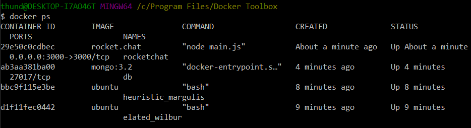
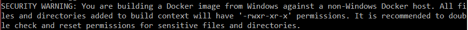
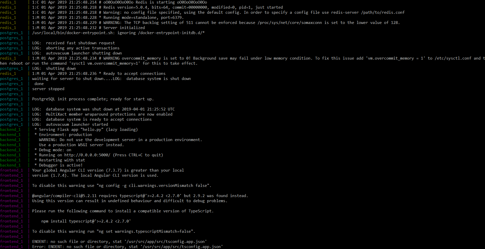
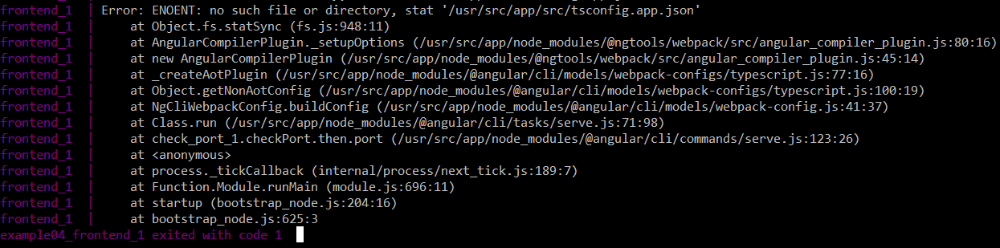

# Lab 9

## Example 1

I think it's interesting how all the options work together, without having to do something like docker run -i -t ubuntu bash or something.
I ran the code ```docker run -it ubuntu bash``` and it was able to successfully able to run ubuntu's bash terminal.
I ran into an error trying to make a file in vim, and I couldn't figure out how to exit vim other than by closing the docker terminal. 
I also couldn't install cowsay with the command line ```apt install cowsay``` because it gave the message ```E: Unable to locate package cowsay```.
A TA came by and helped me by saying that I had to run ```apt update``` again, so I did that.

Try 2 at home.
I ran ```apt update```. It worked! Then I ran ```apt install cowsay```. Then I ran ```su``` and then ```cowsay moo!``` and it worked.


## Example 2

I ran ```docker run --name db -d mongo:3.2 mongod --smallfiles```, and it properly installed it. 
I think this lab suddenly springs a bunch of new options on you, without explaining all of them. It doesn't even explain what ```--smallfiles``` does.
Then I ran the ```docker run --name rocketchat -p 3000:3000 --env ROOT_URL=http://localhost --link db:db -d rocket.chat```, which had even more options
and stuff that they don't explain. 



## Example 3

For this one, I had to navigate to where I had the Dockerfile stored, but after that, ```touch Dockerfile``` worked just fine.
A lot of this one was just reading the README.md, and I think I did a decent job. 
I thought for a second the whole thing would just be reading it, until I got to the end.
This message appeared after running ```docker build -t container .```:



After that, when running ```docker run -p 5000:5000 container```, I couldn't connect to localhost:5000 at all. I think it has to do with how I'm not using linux.

## Example 4

I kind of just moved on without fixing the previous issue. 

There was a lot of reading again, and I'm a little worried about the next test.
```docker-compose build``` took a long time to run, but seemed to run without issue.
While trying to run the service with ```docker-compose up```, it said that the port 5000 is already allocated. I think this was because of the previous container, so I went back to example02 and looked for how to remove containers
I was able to remove it using ```docker rm 410c9cd9d5f5```, which was the id for the container.
I ran ```docker-compose up``` again, and it seemed to work for a while, but ran into another, bigger error.





Also, the localhost:4200 website didn't work either...